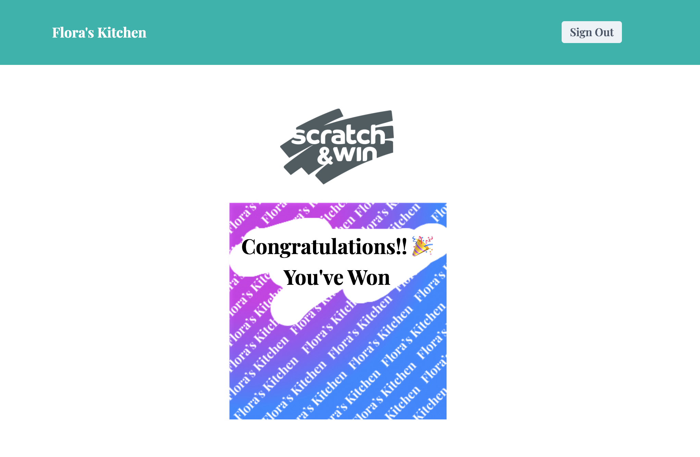

# Scratch N Win
Built with Next.js

<p align="center">

</p>

## Features
- Authentication via Firebase Auth
- Scratch Card Functionality
- Single Scratch Limitations

## Demo
https://floraskitchen.in/

## Follow me at
<a href="https://github.com/dr5hn/"></a> <a href="https://twitter.com/dr5hn/"></a> <a href="https://www.linkedin.com/in/dr5hn/"></a>

## Contributions / Suggestions / Feedbacks
```
Contributions, Suggestions & Feedbacks are Most Welcome
Get in touch with me at gadadarshan[at]gmail[dot]com
```

That's all Folks !! Enjoy.
